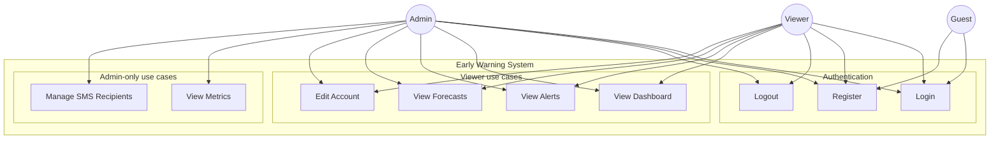
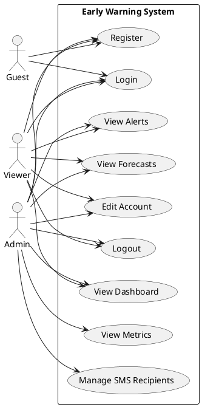

# Early Warning System (EWS) – Use Case Diagram

## Actors

| Actor    | Description |
|----------|-------------|
| **Guest**  | Not logged in; can only reach login/register. |
| **Viewer** | Logged-in user with role `viewer`. Can view dashboard, alerts, forecasts, and edit account. |
| **Admin**  | Logged-in user with role `admin`. Same as Viewer plus: view metrics, manage SMS recipients. |

## Use cases (system boundary: EWS app)

- **Login** – Sign in with email and password.  
- **Register** – Create account (email/password); default role is viewer.  
- **Logout** – Sign out.  
- **View Dashboard** – See latest sensor data (temperature, pH, DO, salinity, TDS, aeration) and warnings.  
- **View Alerts** – See forecast status and early warnings from forecasts.  
- **View Forecasts** – See forecast status and 24h forecast charts per parameter.  
- **View Metrics** – *(Admin only)* See MAE/RMSE for latest forecast run.  
- **Manage SMS Recipients** – *(Admin only)* Create, read, update, delete SMS alert recipients.  
- **Edit Account** – Change email (with current password) or change password.  

---

## Diagram (Mermaid)

---

## Diagram (PlantUML) – classic use case style

Paste the block below into [PlantUML](https://www.plantuml.com/plantuml/uml/) or a PlantUML-supported IDE to render a standard use case diagram.

---

## Summary

| Use case                 | Guest | Viewer | Admin |
|--------------------------|:----:|:------:|:-----:|
| Login                    | ✓    | ✓      | ✓     |
| Register                 | ✓    | ✓      | ✓     |
| Logout                   | —    | ✓      | ✓     |
| View Dashboard           | —    | ✓      | ✓     |
| View Alerts              | —    | ✓      | ✓     |
| View Forecasts            | —    | ✓      | ✓     |
| View Metrics             | —    | —      | ✓     |
| Manage SMS Recipients    | —    | —      | ✓     |
| Edit Account             | —    | ✓      | ✓     |
